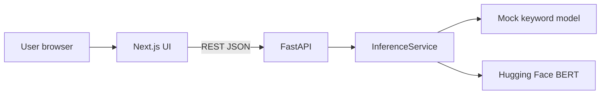

# UAV Mission Intent Analyzer

Production-style academic web system that turns natural-language UAV mission requests into **intent labels**, **operational domains**, **confidence**, **top alternative classes**, and a **rule-based workflow recommendation**. The stack pairs a **FastAPI** inference service (BERT-capable via Hugging Face, with a deterministic **mock** adapter for demos) and a **Next.js** client with chat-style input, structured results, session history, and an admin/API test page.

## Architecture

- **`backend/`** — FastAPI application with thin routers (`/health`, `/labels`, `/samples`, `/predict`), Pydantic schemas, and a pluggable `InferenceService` (`mock` or `hf`).
- **`frontend/`** — Next.js (App Router) + TypeScript + Tailwind CSS v4; calls the backend using `NEXT_PUBLIC_API_BASE_URL`.



## Supported domains (v1)

| Label ID           | Domain               |
| ------------------ | -------------------- |
| `agriculture`      | Agriculture          |
| `defence_military` | Defence / military   |
| `surveillance`     | Surveillance         |
| `rescue`           | Rescue               |

## Local setup

### Prerequisites

- Python **3.11+**
- Node.js **20+** and npm

### Backend

```bash
cd backend
python -m venv .venv
.venv\Scripts\activate   # Windows
# source .venv/bin/activate  # macOS/Linux
pip install -r requirements.txt
copy .env.example .env    # optional; defaults work for mock
uvicorn app.main:app --reload --host 127.0.0.1 --port 8000
```

### Frontend

```bash
cd frontend
copy .env.example .env.local   # set NEXT_PUBLIC_API_BASE_URL if needed
npm install
npm run dev
```

Open [http://localhost:3000](http://localhost:3000). Ensure the backend is on port **8000** or update `NEXT_PUBLIC_API_BASE_URL`.

### Windows: one-shot dev launch

From the repo root in PowerShell:

```powershell
.\run-dev.ps1
```

If scripts are blocked: `powershell -ExecutionPolicy Bypass -File .\run-dev.ps1`

This opens **two** windows (backend + frontend) and your default browser. **Leave both windows open** while you use the app.

### “Not opening” on your laptop (common causes)

1. **Only one server running** — The UI needs **both** `uvicorn` (port 8000) and `next dev` (port 3000). If either terminal is closed or shows an error, the browser will show **connection refused** or the analyzer will fail to load data.
2. **Use Chrome or Edge** — Open `http://localhost:3000` in a normal browser. Cursor’s **embedded/simple browser** sometimes fails to connect even when the dev server is fine.
3. **Dependencies** — Run `pip install -r backend/requirements.txt` and `npm install` inside `frontend` once.
4. **Port in use** — Another app using 3000 or 8000 will prevent startup; change the port or stop the other program.
5. **Firewall** — Rare for localhost; if you test from a phone on Wi‑Fi, allow Node/Python on private networks and set `NEXT_PUBLIC_API_BASE_URL` to `http://<your-PC-LAN-IP>:8000` plus `CORS_ORIGINS` on the backend.

## Environment variables

### Backend (`backend/.env`)

| Variable              | Description                                        | Default                                              |
| --------------------- | -------------------------------------------------- | ---------------------------------------------------- |
| `MODEL_BACKEND`       | `mock` or `hf`                                     | `mock`                                               |
| `HF_MODEL_ID`         | Hugging Face model id (sequence classification)  | unset                                                |
| `HF_LOCAL_FILES_ONLY` | Load only local files                              | `false`                                              |
| `CORS_ORIGINS`        | Comma-separated allowed browser origins            | `http://localhost:3000,http://127.0.0.1:3000`        |
| `MAX_INPUT_CHARS`     | Max characters accepted for `/predict`             | `2000`                                               |

### Frontend (`frontend/.env.local`)

| Variable                     | Description                |
| ---------------------------- | -------------------------- |
| `NEXT_PUBLIC_API_BASE_URL`   | Backend origin, no trailing slash |

### Using a real Hugging Face model

1. Train or export a **sequence classification** checkpoint whose `id2label` entries map to (or can be normalized to) `agriculture`, `defence_military`, `surveillance`, `rescue`.
2. Set `MODEL_BACKEND=hf` and `HF_MODEL_ID=<your/model>`.
3. If load fails, the service **falls back to mock** and logs the error.

## API

- `GET /health` — Liveness and model backend metadata.
- `GET /labels` — Label ids, domains, and `label_to_domain` map.
- `GET /samples` — Curated example prompts (see `backend/data/sample_prompts.json`).
- `POST /predict` — Body: `{ "text": "..." }`. Returns prediction payload including `top_predictions` (3 items) and `recommended_action`.

## Tests and quality gates

### Backend

```bash
cd backend
python -m pytest tests/ -q
python -m ruff check app tests
```

### Frontend

```bash
cd frontend
npm run lint
npm run build
npm run test:e2e
```

`test:e2e` starts the dev server automatically (Playwright). Install browsers once with `npx playwright install chromium`.

## Deployment

### Frontend — Vercel

1. Create a Vercel project with **root directory** `frontend`.
2. Set **`NEXT_PUBLIC_API_BASE_URL`** to your public API URL (Render or other), e.g. `https://your-api.onrender.com`.
3. Build command: `npm run build`; output: Next.js default.

`frontend/vercel.json` documents the framework preset.

### Backend — Render

1. New **Web Service**, runtime **Python 3**, root **`backend`**.
2. Build: `pip install -r requirements.txt`
3. Start: `uvicorn app.main:app --host 0.0.0.0 --port $PORT`
4. Set **`CORS_ORIGINS`** to your Vercel domain(s), comma-separated, e.g. `https://your-app.vercel.app`.

A starter `render.yaml` is included for Blueprint-style deploys; adjust `plan` and env as needed.

**Note:** Free-tier CPU inference with PyTorch + Transformers can be slow or memory-heavy; `MODEL_BACKEND=mock` is the most reliable option for live demos unless you size the instance appropriately.

## Demo flow (presentation)

1. Start backend and frontend locally.
2. Open **Home** — explain domains and outputs.
3. Open **Analyzer** — paste or chip-select a mission; show confidence bar, alternatives, recommendation card, and **session history**.
4. Open **Admin** — show `/health`, `/labels`, and a smoke `/predict`.

## Manual QA checklist

- [ ] Landing, Analyzer, and Admin routes load on desktop and mobile widths.
- [ ] Dark mode toggle persists across navigation.
- [ ] Analyzer handles loading, empty, success, and API error states.
- [ ] Session history stores, replays, and clears entries (same browser session).
- [ ] Admin reflects backend health when API is up; shows errors when API is down.
- [ ] CORS works when frontend and backend are on different localhost ports or deployed URLs.

## Project layout

```
uav chatbot/
├── backend/
│   ├── app/
│   ├── data/sample_prompts.json
│   ├── requirements.txt
│   └── tests/
├── frontend/
│   ├── src/app/
│   ├── src/components/
│   ├── src/lib/
│   ├── tests/e2e/
│   └── vercel.json
├── gsd-cursor/          # vendored GSD for Cursor (commands, agents, install scripts)
├── render.yaml
└── README.md
```

## Get Shit Done (GSD) for Cursor

This repo includes a **vendored copy** of [GSD for Cursor](https://github.com/rmindel/gsd-for-cursor) under `gsd-cursor/` (MIT). Slash commands use the `/gsd/...` prefix (for example `/gsd/help`, `/gsd/map-codebase`).

**Note:** The URL `https://github.com/toonight/get-shit-done-for-cursor` was not reachable (404) at install time, so the maintained **rmindel/gsd-for-cursor** adaptation was used instead—it tracks the same GSD workflow family as [toonight/get-shit-done-for-antigravity](https://github.com/toonight/get-shit-done-for-antigravity).

### Already installed on this machine

The installer was run with `-Force`, copying commands, agents, workflows, templates, and hooks into `%USERPROFILE%\.cursor\` and merging GSD entries into `%USERPROFILE%\.cursor\settings.json`.

### Re-install or update later

```powershell
cd gsd-cursor\scripts
.\install.ps1 -Force
```

See `gsd-cursor/README.md` and `gsd-cursor/docs/GSD-CURSOR-ADAPTATION.md` for the full command list and behavior.

## License / academic use

Built for final-year demonstration. Verify compliance with your institution’s policies before using real mission or operational data.
